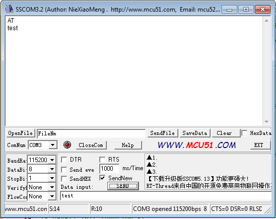

# STM32_UART_interrupt
This code will transmit data via serial (UART) and receive

This project was developed with :-  
1. STM32CubeMX 6.0.1  
2. Keil uVision 5.32.0.0 

List of hardwares used :- 
1. STM32 blue pill 
2. DC-DC converter module
3. lithium polymer battery
4. ST-Link V2 programmer
5. CH340 USB to Serial

Reference: https://www.programmersought.com/article/1033788456/
